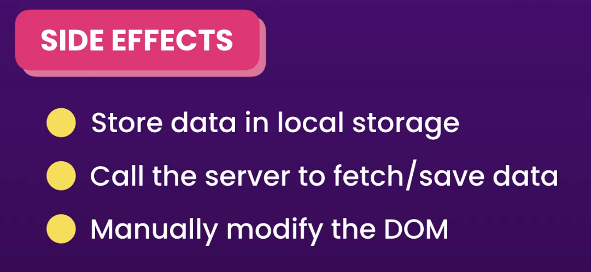
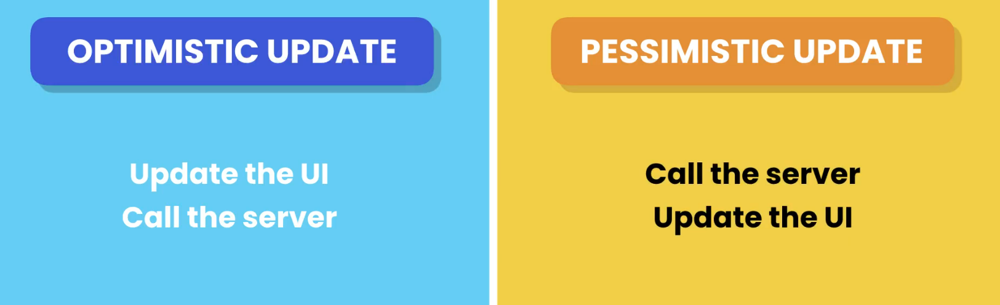

# 6. Connecting to Backend

## Understanding the Effect Hooks

React components should be **pure functions**. That means:

- They should always return the **same output** (JSX) for the **same input (props/state)**.

- They should **not produce side effects** — _no code that changes anything outside the component_ or _affects the app outside of returning JSX_.

#### Why Avoid Side Effects in Rendering?

During rendering, React expects components to be pure so it can efficiently manage updates. Side effects—like changing the DOM directly, fetching data, setting timers, or updating global variables—should **not** happen inside the main body of the component function because it breaks purity.

But there are places where we need some side effects.



None of the above situations are about rendering a component. They have nothing to do with returning the JSX. These actions don’t affect the returned JSX, so they are considered side effects.

React provides the `useEffect` hook to run side effects after the component has rendered. This allows you to keep your component function pure while still performing necessary side effects.

Here’s an example of what not to do:

```javascript
function App() {
  const inputRef = useRef < HTMLInputElement > null;

  // Side Effect
  if (inputRef.current) {
    inputRef.current.focus();
  }

  return (
    <div>
      <input ref={inputRef} type="text" className="form-control" />
    </div>
  );
}
```

This code runs during rendering and directly changes the DOM, which breaks the purity of the component.

Use `useEffect` to run the focus logic after the component renders:

```javascript
import { useEffect, useRef } from "react";

function App() {
  const inputRef = useRef < HTMLInputElement > null;

  // Side Effect
  useEffect(() => {
    if (inputRef.current) {
      inputRef.current.focus();
    }
  }, []);

  return (
    <div>
      <input ref={inputRef} type="text" className="form-control" />
    </div>
  );
}

export default App;
```

- The code inside useEffect runs after the render phase.
- This keeps the component pure because the rendering function only returns JSX.
- The side effect (focusing the input) happens safely afterward.

Note - You **cannot call** `useEffect` conditionally or inside loops — it must be called **at the top level** of your component.

## Effect Dependencies

```javascript
useEffect(() => {
  console.log("Fetching Products");
  setProducts(["Clothing", "HouseHold"]);
});
```

In the above code, this **runs infinitely** because when we don’t have a dependency array, the **effect runs after every render**. So it runs after the initial render, then `setProducts` updates the state, which causes the component to render again, and then the effect runs again. This cycle repeats indefinitely, causing the effect to run infinitely.

```javascript
useEffect(() => {
  console.log("Fetching Products");
  setProducts(["Clothing", "HouseHold"]);
}, []);
```

In the above code, the `useEffect` will only run on the **initial render** because the dependency array is empty. That means the effect runs only once when the component mounts and **does not run again** on re-renders.

```javascript
// App Component
function App() {
  const [category, setCategory] = useState("");

  return (
    <div>
      <select
        className="form-select"
        onChange={(e) => setCategory(e.target.value)}
      >
        <option value=""></option>
        <option value="Clothing">Clothing</option>
        <option value="HouseHold">HouseHold</option>
      </select>
      <ProductList category={category} />
    </div>
  );
}

// ProductList
const ProductList = ({ category }: { category: string }) => {
  useEffect(() => {
    console.log("Fetching Products", category);
  }, [category]);
  return <div>{category}</div>;
};
```

In the above code, when the value of the dependency (`category`) changes, the `useEffect` runs again.

This is because we passed `[category]` as the dependency array to the `useEffect`, so every time the category value updates (for example, when the user selects a different option), the effect gets triggered again.

## Effect Clean Up

Sometimes, the code we pass to the `useEffect` hook needs to be **cleaned up**. To provide cleanup code, we **return a function** from the effect. This function is used to **disconnect or unsubscribe** from whatever the effect was doing.

Generally, our **cleanup function** should **stop or undo** whatever the effect was doing. For example:

- If we are **connecting** to something or _subscribing_, the cleanup function should unsubscribe or call `disconnect()`.
- If we are showing a **modal**, the cleanup function should **hide the modal**.
- If our effect is **fetching data**, the cleanup function should **abort the fetch** or **ignore the result** if it's no longer needed.

The **cleanup function** will execute when:

- The component is **unmounted** (when the component remove from teh screen), or
- Before the effect runs again (if dependencies have changed)

## Fetching Data

To fetch data, we can use `fetch` or `Axios`.

When calling a server, we have to wait for the response. It may take half a second or more. So, it returns a **Promise**. A **Promise** is an object that holds the eventual **result** or **failure** of an asynchronous operation. (**Asynchronous** means the operation takes some time to complete, like a long-running task.)

## Understanding HTTP Requests

When we call a GET method, Axios sends an HTTP request to the server.

HTTP stands for **HyperText Transfer Protocol**. It is the protocol used for transferring data over the internet — essentially, it's what powers the web.

When we visit a website, our browser sends an HTTP request to the website’s server, asking for some content. The server then responds with data that usually includes HTML, CSS, JavaScript, and other resources needed to display the website in our browser.

Every HTTP request has two main parts:

- **Headers**: These contain metadata such as content type, authentication info, and more.

- **Body**: This contains the actual data being sent.

## Working with Async and Await

We can write promises in a more linear way using `async` and `await`.

If the promise is **resolved**, we can get the **response object**, or if the promise is **rejected**, we can get the **error**. (For now, we can use `.then()` to get the response object and `.catch()` to get the error.)

In async/await we can also use `await` to get the response object, and by using a `try...catch` block, we can catch the error.

## Cancelling a fetch Request

When we send an HTTP request in a React component (usually inside a useEffect), it's important to also handle cleanup. If the user navigates away from the page before the request completes, we don’t want to continue processing or rendering the returned data. This can lead to memory leaks or unexpected behavior.

As a best practice, whenever you fetch data in a useEffect, you should provide a cleanup function to cancel the request if it's no longer needed.

To do this, we can use the built-in AbortController class available in modern browsers. AbortController allows us to abort operations like fetch requests, DOM Manipulation or any operations that might take long to xomplete. This is useful for stopping long-running tasks if the component unmounts or if the request is no longer relevant.

#### Example OF Promises

```javascript
  useEffect(() => {
    const controller = new AbortController();

    axios
      .get<User[]>("https://jsonplaceholder.typicode.com/users", {
        signal: controller.signal,
      })
      .then((res) => setUsers(res.data))
      .catch((err) => {
        if (err instanceof CanceledError) {
          return;
        }
        setError(err.message);
      });

    return () => controller.abort();
  }, []);
```

#### Example OF Async/Await

```javascript
useEffect(() => {
  const controller = new AbortController();

  const fetchUsers = async () => {
    try {
      const res = await axios.get<User[]>(
        "https://jsonplaceholder.typicode.com/users",
        { signal: controller.signal }
      );
      setUsers(res.data);
    } catch (error) {
      if (axios.isCancel(error)) {
        // Request was cancelled
        return;
      }
      setError((error as AxiosError).message);
    }
  };

  fetchUsers();

  return () => {
    controller.abort(); // Cancel the request on cleanup
  };
}, []);
```

In the above example, we use AbortController for cleanup.

But this doesn't cancel the **previous request** automatically (for example, if the network is slow and multiple requests are triggered, you might end up receiving the response from an older request instead of the latest one).

To handle that, we can either use AbortController with a global variable, or — the cleaner method — is to use a `ref`.

```javascript
const controllerRef = useRef<AbortController | null>(null);

useEffect(() => {
  if (controllerRef.current) {
    controllerRef.current.abort(); // Cancel previous request
  }

  const controller = new AbortController();
  controllerRef.current = controller;

  axios
    .get<User[]>("https://jsonplaceholder.typicode.com/users", {
      signal: controller.signal,
    })
    .then((res) => setUsers(res.data))
    .catch((err) => {
      if (axios.isCancel(err)) {
        console.log("Request canceled");
        return;
      }
      setError(err.message);
    });

  return () => controller.abort(); // Cleanup on unmount
}, []);

```

## Loading the indicator

Whether you're using **Promises** or **async/await**, if you're setting a `loading` flag (e.g., `setLoading(true)` before a request), you **should always reset it** (`setLoading(false)`) in a **finally** block

**Promises** – If we use `loader` without a `finally` block, before resolving the promise, it will move to the `loading` flag line (the loader disappears too early).

**Async/await** – In here, since `await` is used and we write the code inside an `async` function, as soon as the controller sees the loader, it will **stop execution** of the function. But if it returns an error, it will* never go to the line below loader lines* , and the loader will **stay forever**.

## Deleting / Creating / Updating Data



## Extracting the User Service

Refer the async/await return note in Excalidraw

## Creating a custom data fetching Hook

Custom Hooks can be used to share functionality across different components

A hook is just a function.

But, Hooks aren't just for sharing functionality — they help separate concerns and make code more modular, readable, and maintainable.
