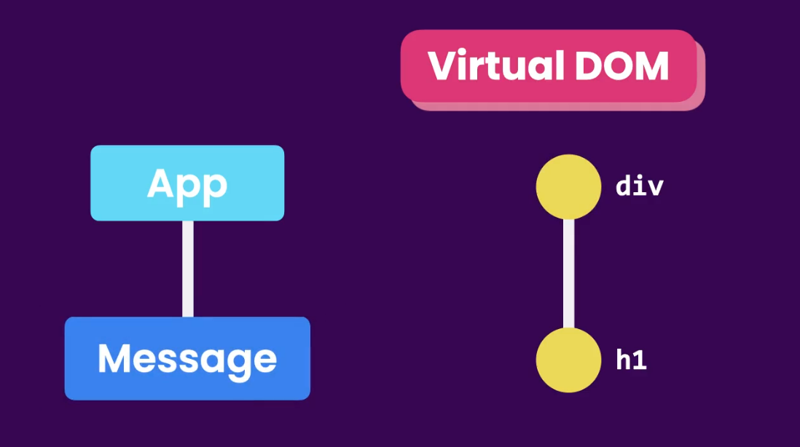
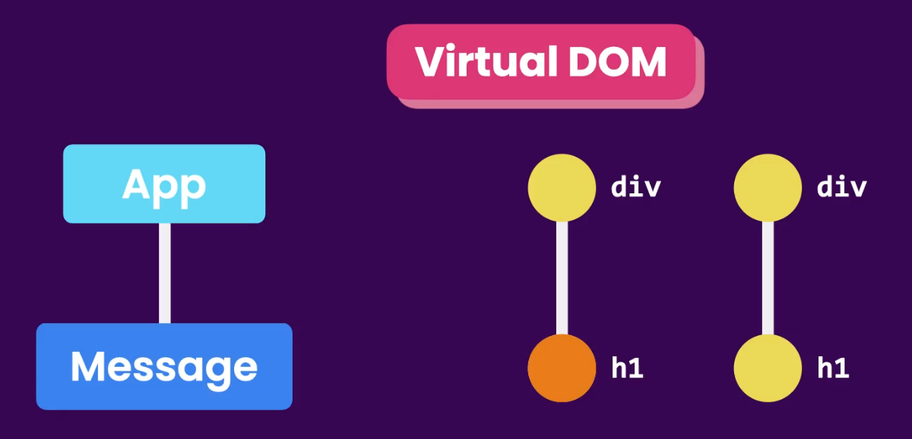
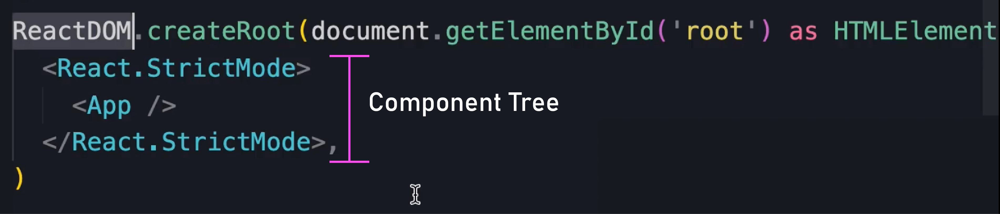

# 1. Getting Started With React

## What is React ?

Reactr is a Javascript library for Building the interactive User Intefaces. It was created in Facebook at 2011.

### Why was React created?

When a webpage loads in the browser, the browser reads the HTML and creates a tree-like structure called the **DOM (Document Object Model)**. This structure allows JavaScript to interact with and update parts of the page in response to user actions.

However, as web applications grow larger and more complex, manually working with the DOM using methods like `getElementById` or `querySelector` becomes difficult to manage and error-prone.

This is where React comes in.

With React, you build your UI using **small, reusable components**. You simply describe how the UI should look, and React efficiently updates and manages the DOM for you. This makes your code cleaner, more organized, and easier to maintain as your application grows.

Essentialy, A React application is essentially a tree of components, where each component represents a part of the user interface. At the top of this tree is the root component((often called `<App />`) ), which brings everything together and renders the entire app.

## Creating a React Component

In React, whenever we create a function-based component, we need to follow Pascal Case (i.e., start the component name with a **capital letter**). This is what React expects.

In React, we use JSX or TSX. JSX stands for **JavaScript XML**. If we visit **babel.io/repl** and paste React code, it will show the equivalent plain JavaScript code.

The great thing about JSX and TSX is that they allow us to create dynamic content using curly braces ({}) inside the markup.

## How React Works

Let’s imagine currently we have the below component tree of App and Message.

When our application starts, React takes the component tree and builds a JavaScript data structure called the **Virtual DOM**. This Virtual DOM is different from the actual DOM in the browser. It's a lightweight, in-memory representation of the component tree, where each node represents a component and its properties.



When the _state_ or the _data_ of a component changes, React updates the corresponding node in the Virtual DOM to reflect the new state. Then it compares the current version of the Virtual DOM with the previous version to identify the nodes that should be updated. It will then update those nodes in the actual DOM.



Technically, updating the DOM is not done by React itself. It is done by a companion library called ReactDOM. ( In index.html, we have a `<div>` with an ID of root. This is the container of our application. Below that, we have a `<script>` element referencing `main.tsx`. Inside that file, it uses ReactDOM to render this component tree inside the element with the ID of root. )



So we are taking the component tree and rendering and displaying it inside an element with the ID of root. And to do that, we use the ReactDOM library. (But we can also render this component tree in a mobile app using another library called React Native.)

So React itself is not tied to a particular platform like web or mobile. It's platform-agnostic, and we can use it to build apps for web, mobile, and desktop devices.

## React Ecosystem

React is a **library**, while Angular and Vue.js are **frameworks**.

A **library** is a tool that provides specific functionality. A **framework** is a set of tools and guidelines for building applications. (So, a library is like a single tool, while a framework is like a toolset.)

So, **React is just a library** or tool used for building user interfaces. The only thing it does—and does well—is create dynamic and interactive user interfaces.

But to build a complete application, we need additional tools such as:

- Routing
- HTTP requests
- State management
- Internationalization - preparing your application to support multiple languages and regions
- Form validation
- Animations
- And more...

The great thing about React is that it doesn't force us to use any specific tools for those needs. It doesn't include opinions or constraints about what other tools you should use. So, we have the freedom to choose the right tools for the job.

# 2. Building Components

In **JSX**, the return statement can only include:

- **HTML-like tags** (e.g., `<div>`, `<h1>`)
- **React components** (e.g., `<MyComponent />`)
- **Curly braces** `{}` for dynamic expressions (e.g., `{name}` or `{count + 1}`)

You can't return regular JavaScript statements like `if`, `for`, or `console.log` directly inside JSX.

## Handling Events

We can handle events in two different ways.

### 1.Inside onClick:

```javascript
<li
  key={item}
  className="list-group-item"
  onClick={(e) => {
    console.log(2);
  }}
>
  {item}
</li>
```

### 2. Using another function:

```javascript
const handleClick = (event: React.MouseEvent): void => {
  console.log(event);
};

<li key={item} className="list-group-item" onClick={handleClick}>
  {item}
</li>;
```

Here, when the user clicks the list item, it will refer to the `handleClick` function and execute it.

You're passing the **function reference**. React saves that function and calls it **only when the user clicks**. **It does not run immediately** when rendering.

But if we use `onClick={handleClick()}`, then it will **call the function immediately** when rendering.
React will take the **return value** of that function (usually `undefined`) and assign it to onClick, which is not what we want.

We don't need to call the function at that time — we only need to **reference it**, so that when the user clicks it, the function will execute.
