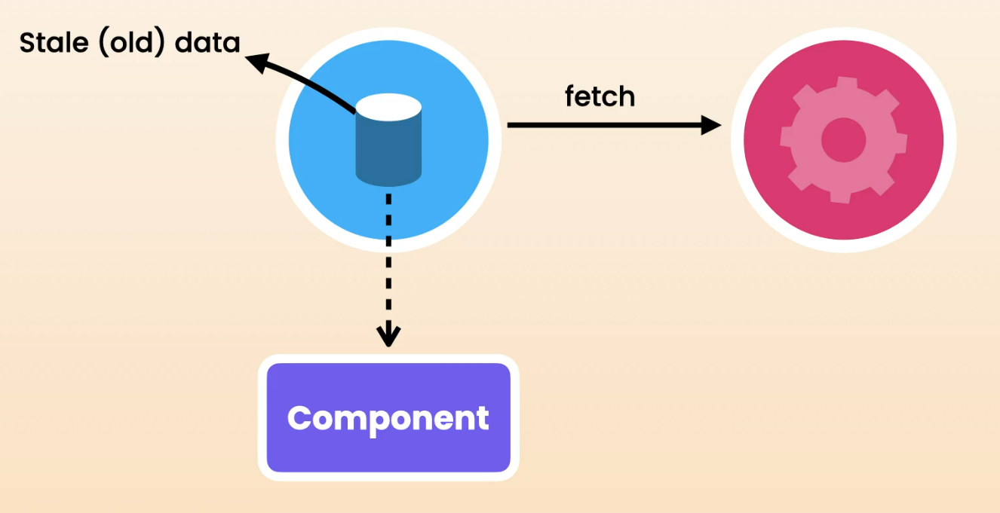
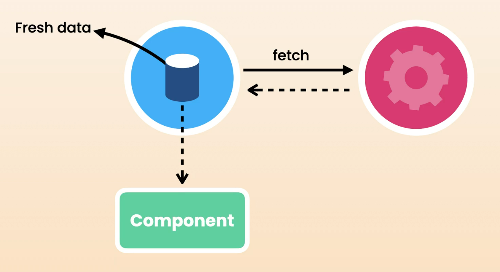

# 7. React Query

## What is React Query ?

So far, we use the `useEffect` hook for data fetching. But this has a few problems:

- No request cancellation – We have to use `AbortController` to manually do that.
- No separation of concerns – We have to use a custom hook to achieve that.
- No retries
- No automatic refresh
- No caching

We can do all of the above using `useEffect`, but we have to write more and more code. So as a solution, we can use **React Query**, which provides all of these features out of the box.

**React Query** is a powerful library for managing data fetching and caching in React applications.

Some people use **Redux** for caching. Redux is a popular state management library for JavaScript applications. It allows us to store the state/data of an application in a single global store. So, a lot of people use it as a cache—when they fetch data, they store it in Redux so they can use it in the future.

But the problem with Redux is that it is difficult to learn, has a lot of boilerplate code, and makes our application harder to debug and maintain. But with **React Query**, it's a lot simpler and more lightweight.

So Redux is no longer needed for caching.

## Setting up the React Query

queryClient is teh core object we used for managing and caching remote data in React Query.

Note ( Important ) - In React Query, the queryFn does not accept resolved data. It **expects a function that returns a Promise, not the actual data itself**. ( But That **Promise should have the resolved response data** — not the full response object)

( Note - Actually, React quety accepts the whole response object, But In components, we will have to write data.data, which is complex and noisy )

```javascript
const TodoList = () => {
  const fetchTodos = () => {
    return axios  // 3. returns the new promise
      .get<Todo[]>("https://jsonplaceholder.typicode.com/todos")
      .then((res) => {
        return res.data;  // 1. resolving the object and returning the data
      }); // 2. Wraps the data in another promise

  };


  const { data: todos, error } = useQuery<Todo[], Error>({
    queryKey: ["todos"],
    queryFn: fetchTodos,  // 4. A Promise with resolved data
  });

}
```

## Handling Errors

React Query doesn't know the exact type of error when fetching data because it depends on how the data is fetched. For example, whether you use `fetch`, `axios`, or another library—each can return different types of error objects.

If you're using Axios, the errors are usually instances of the `Error` interface, which is available in all browsers.

## Using React Query Dev Tools

Similar to many frontend libraries, React Query comes with its own dev tool. It is a powerful tool for debugging and monitoring queries.

The `<ReactQueryDevTools>` component should be added to the component tree **after** the `App` component.

In the dev tools, the **number of observers** refers to how many components are currently using a particular query. If a component that uses a query is unmounted from the screen, the observer count for that query will decrease. When the **observer count reaches 0**, the query becomes **inactive**. Inactive queries will eventually be **garbage collected** and removed from the cache.

By default, all queries have a **cache time of 5 minutes**.

## Customizing Query Settings

React Query comes with a few default settings, but we can always customize them either per query or globally.

```javascript
const queryClient = new QueryClient({
  defaultOptions: {
    queries: {
      retry: 3,
      gcTime: 300_000, // 5 mins
      staleTime: 10 * 1000, // 10 s
      refetchOnWindowFocus: false,
    },
  },
});
```

- **Retry** – Retries the request if it fails.

- **gcTime** – Previously known as cacheTime. This defines how long inactive data is kept in the cache before being garbage collected.

- **staleTime** – This is the duration for which data is considered fresh. By default, staleTime is 0, which means data is treated as stale(old) immediately after it’s fetched. So, the next time we request the same data, React Query will fetch it again from the backend. However, if we set staleTime to 5 minutes, React Query will consider the data fresh for 5 minutes. During that time, if we request the same data, React Query will serve the previously fetched data without calling the backend again. (No request to the server is made during that time, unless **you manually refetch** or other **conditions override it** (Query key changes,Manual invalidateQueries() ).)

React Query **automatically refreshes stale data under 3 situations**:

- When the network is reconnected
- When a component is mounted
- When the window is refocused (e.g., when switching from another browser tab or desktop window to this tab)

But we can control this behavior by setting the following options to `false`:

- refetchOnWindowFocus
- refetchOnReconnect
- refetchOnMount

---

While React Query attempting to fetch the latest data from the backend. At the same time, it will immediately return the stale data from the cache to the component.



Once the updated data is received, React Query updates the cache and notifies the component that new data is available. The component then re-renders using the updated data.



## Parameterized Queries

```javascript
queryKey: userId ? ["users", userId, "posts"] : ["posts"],
```

When we add the `value(variable)` to **queryKey**, it refetches the data when that parameter changes. It works like the dependency array in useEffect.

---

Here, we write the `queryKey` like we are implementing the route. When we want to get posts by a user, we apply it as `users/2(userId)/posts`. This is the same convention used in React Query. This is helpful when caching data and refreshing the `correct data` when necessary. (store correct data - correct posts for the correct user)

## Paginated Queries

We can use `queryKey` to create pagination. When the page changes, the `queryKey` changes and fetches the correct data.

But another important thing is we can avoid flickering when fetching new data for that page. Normally, when we request data for a new page, the page reloads and jumps to the top, and we have to scroll back to the position again.

But with the new option, we can avoid flickering to improve the user experience:

```javascript
placeholderData: (previousData) => previousData;

// or

placeholderData: keepPreviousData; // will be deprecated in the near future
```

## Infinite Queries

Use below link

https://dev.to/dravidjones28/how-to-implement-infinite-queries-in-react-query-22e6

## Mutating Data

For mutating data, we use the `useMutation` hook from React Query.

When updating the list(UI) after we add(update/delete) a todo, we can use two methods:

In the `onSuccess` method:

- The **first argument** (`savedTodo`) is the **response received from the server**.
- The **second argument** (`newTodo`) is the **data we sent to the server**.

In **React Query**, you'll notice in **IntelliSense** that the word `variables` is often used — this refers to the **input** sent to the backend (i.e., the data passed into the mutation function).

### 1. First Approach – Invalidating the Cache

This way, React Query will refetch all the data from the backend.
(This does not work with JSONPlaceholder, because the object we send to the fake API is not persistent.)

```javascript
const queryClient = useQueryClient();

// APPROACH: Invalidating the cache
queryClient.invalidateQueries({
  queryKey: ["todos"],
});
```

### 2. Another Approach – Updating the Data in Cache Directly

Instead of refetching, we manually update the cache:

```javascript
queryClient.setQueryData<Todo[]>(["todos"], (todos) => [
  savedTodo,
  ...(todos || []),
]);
```

## Optimistic Updates

Instead of the current pessimistic update approach (where we update the UI after receiving a response from the backend), we can use the optimistic update approach — update the UI first, and if there's an error, revert the changes.

However, in React Query, implementing optimistic updates is a bit more complex.

The onMutate function runs before the mutation function is executed.
