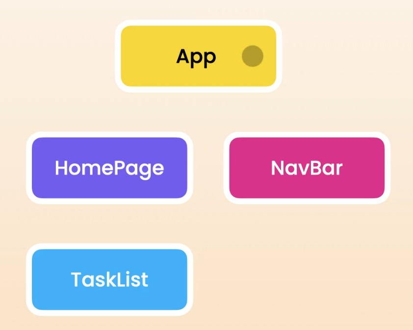
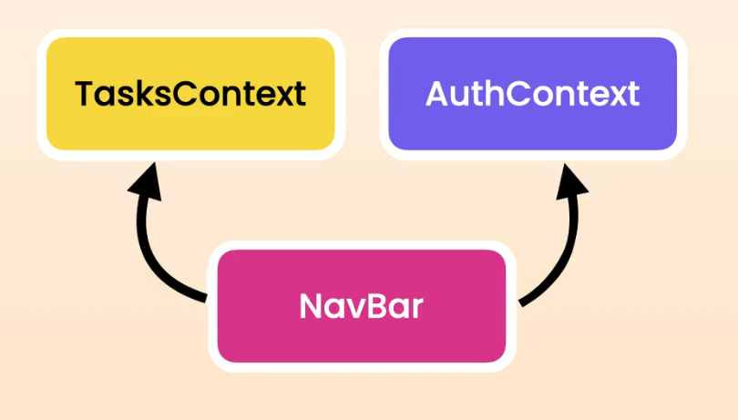
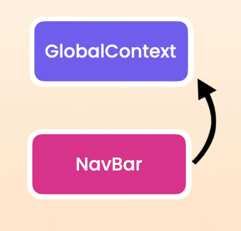
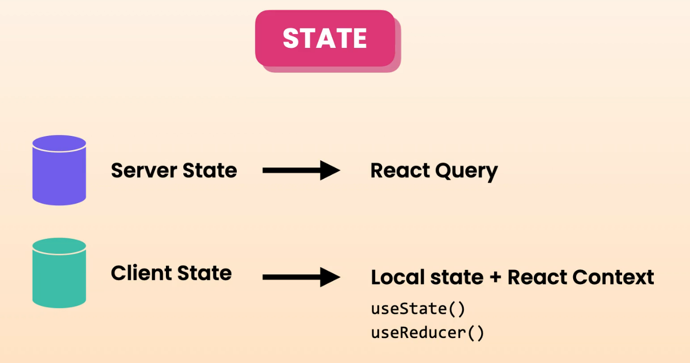
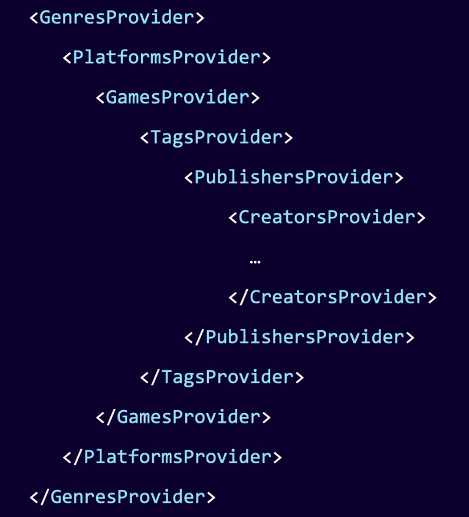
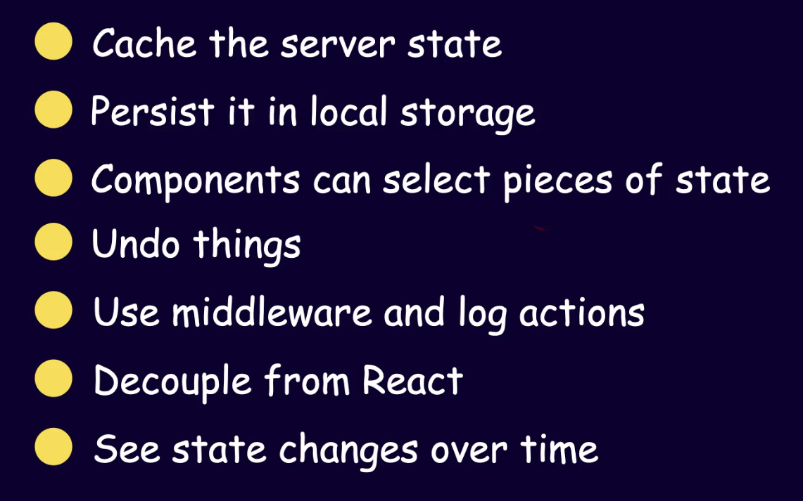
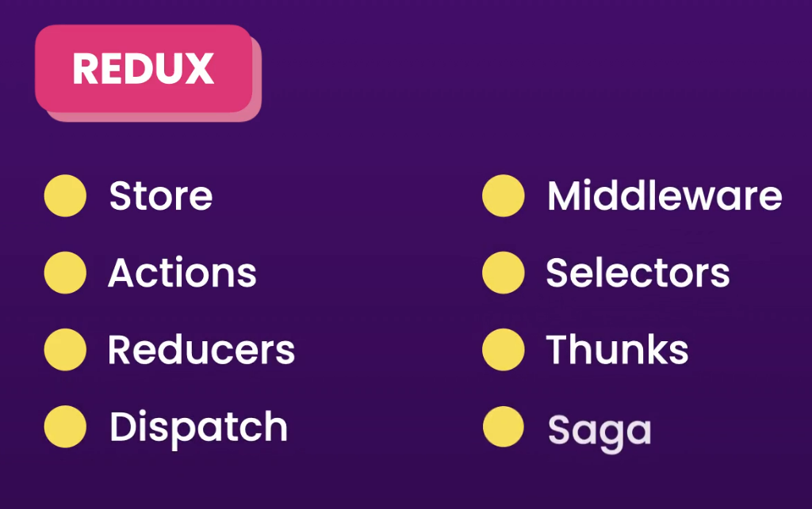

# 8. Global State Management

## Consolidating State Logic with a Reducer

Reducer is a function that allow us to centralize state updates in a component. ( Using a reducer we can take all the state management logic outside of the component and centralize it inside a single function )

Reducer function has two parameters: **first parameter** is **current state** and **second parameter** is an **action**. An action is an object that describes what the user is trying to do. And then **reducer returns the new state**.

```javascript
const [value, dispatch] = useReducer(counterReducer, 0);
```

useReducer hook takes two arguments.

- First argument is the reducer function
- Second argument is the initial state

Similar to state hook, reducer also returns an array with two elements:

- First element is the current state
- Second element is the function for triggering changes (In english, Dispatch means sent)

In the example code, when the user clicks the _increment_ button, React will call our reducer and pass the current value as well as the action we just dispatched.

## Sharing state using React Context

**Prop Drilling** means passing data through many components. This is okay for one level, but if we have to pass data through 3 to 4 levels, that is a bit smelly.

As a solution, we can use **React Context**. Context allows us to share data without passing it down through many components in the middle. So our code will be cleaner and more maintainable.



In the above example, the state of tasks is currently stored in the `useReducer` hook inside `TaskList`. Now we need to share it using a React Context.

To share context using React Context, **there are 3 things we need to do**:

1. **First**, we should **lift the state up** to the closest parent (lift the state to the `App` component).

2. **Second**, we should **create a context**. A context is like a truck for transporting data. As part of this, we should specify the type of data we want to transport (in this example, an object with two properties).

3. Once we have the context, we **wrap our component tree using the Provider component** and provide the data we want to share.

Extra – In the Provider, we set the value property. This value overrides the default value provided in createContext(Value inside brackets).

## Debugging with React Dev Tools

We can view the context details in the `Components tab` of the `React Developer Tools`.

## Splitting Code for efficiency

One important thing is: **anytime something in a context changes, all components that use that context will re-render**.

So the Context should only hold tht valuesa that are closely reletaed and tecn to chgnage together



Currently, our `NavBar` depends on two contexts: `TasksContext` and `AuthContext`.

And let’s think—in future we don’t need `TasksContext`. So now we just have to remove it from the `NavBar` component.

With this, it will only re-render if the `AuthContext` (`currentUser`) changes.



However, **if earlier these two contexts had been part of one global context**, then even though we didn’t need `TasksContext`, our NavBar would still re-render when either `AuthContext` or `TasksContext` changed inside the global context.

## When to Use Context



**Server state** is the data we fetch from the backend. We should **avoid using React Context** to share and store server state, because we’ll end up with too many contexts, each holding a certain type of object.

(For example, in our game app project, we will have a deeply nested component tree.)



So, instead, we should let **React Query** manage the server state for us. React Query is designed especially for this purpose and gives us a lot of control over how data is stored and cached.

**Client stat**e is the data that represents the state of the client or UI (examples include `currentUser`, selected theme, filters, and so on). For managing client state, we can either use **local state** (useState or useReducer) or **React Context** (for sharing state).

As a best practice, **Context should have a single responsibility**. We should split them up when necessary to **minimize re-renders**.

But if we have a situation where splitting context doesn’t make sense and we’re dealing with unnecessary re-renders, then we can use a **state management tool**.

**State management tools** allow components to watch a specific piece of state and re-render only when that piece changes.

### State Management Libraries:

- Redux
- MobX
- Recoil
- xState
- Zustand

All of these serve the same purpose, but they **differ in how they handle state and the features they provide**.

## Context vs Redux

Redux is a widely used state management library for JavaScript applications. It provides a centralized store to manage application state. So instead of storing local state in our components, we store all the state in a single global store and have each component access the piece of state that it needs. This way, we don't need to pass data through many components in the middle.

So one of the benefits of using a state management tool is they allow us **to avoid prop drilling**.

Context is **also used** to avoid prop drilling, but it is not a state management tool since it doesn't have a way to store and update data. When using context, we store the state somewhere else. So **Context is a way to transport** and share the state in our application.

Comparing Context with Redux is like comparing a box with a truck carrying the box.

So both React Context and Redux allow us to share state (share data) in our application.

**But does Context replace Redux?**

With Redux, we can:



As software developers, our goal should be to **solve problems of businesses and people**, not **just write code**.

Redux allows us to undo things and log actions, But if that is not a requirement in the application we build, We’re just increasing the complexity by using the wrong tool to solve the problem.

---

Most React applications need a way to manage both **client and server state**. A few years ago, before we had tools like React Query and Zustand, people used Redux to store both the client and server state in a single global store.

But Redux brings a **lot of unnecessary complexity**. When building applications with Redux, we have to deal with several concepts like:



These days, we can manage server state using **React Query**, So we don't have to deal with Redux’s unnecessary concepts. In React Query, we only deal with **Queries** and **Mutations**.

**But what about client state?**

Once we manage the server state with React Query:

- There is very little most apps have in terms of client state (many apps don’t have much client state)
- For simple applications, we can use local state in our components
- And share it using Context
- If our state management logic is complex, we can consolidate state logic using a reducer
- If we still have unnecessary re-renders and need more control over data management, we can use a simple state management tool like **Zustand**

## Preventing Unnecessary Rerenders with Selectors

One of the benefits of a state management tool is that it gives us more control over state management and allows our **components to rerender only if a specific piece of data changes**.

Example → Currently, our counter store has one state — `counter`. For demo purposes, let’s add another state — `max`. Now, our `Navbar` uses the `counterStore`. So by default, when **either** the `counter` or `max` changes in another component, the `Navbar` rerenders again. But by using a **selector**, we can tell the `Navbar` to rerender **only if** `counter` **changes**.
